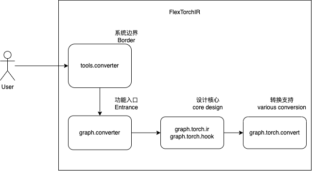

# Design of FlexTorchIR


本文档以中文为主，关键部分同时提供英语。

This document is in Chinese. English is provided at critical parts and I'll try to make it understandable in English. Please ask if anything is obscure.


## Code Structure




## Core Design


#### 1. graph.torch.ir

设计核心、设计假设、设计不动点：

1. 用每个 tensor 的内存地址作为唯一 id，

```
def tensorID(tensor):
    return str(id(tensor))
```

2. `layer.id = output tensor ID`

从而，在 torch model 的一次运行后，所有 layer、tensor 的 ID 可以用来构成完整的网络结构。


Full network structure could be reconstructed by tracing layer's output tensor IDs after a full inference of the torch model.


#### 2. graph.torch.hook

我们需要 hook 到每一层的调用，才能获取到 input 和 output tensor，从而构筑完整的网络结构。

We need to hook every layer in order to gain access to both input and output tensor for reconstructing a whole network structure.


`torch.nn.modules` 好说，torch 本来就支持 hook：

```
def hook_module_forward(module, inputs, outputs):
    # Yay, We've got what we want
    
def forward_post_hook(module, inputs, output):
    inputs = list(inputs)
    hook_module_forward(module, inputs, output)
for mod in model.modules():
    mod.register_module_hook(forward_post_hook)
```


但 `torch.nn.functional.*` 和 `torch.Tensor.*` 下的各类 Activation 和 reshape 等等的算子，都无法支持。

There's no problem hooking `torch.nn.modules`, but it does not hold for `torch.nn.functional.*` 和 `torch.Tensor.*` , where many layers such as activations and reshaping kernels rest inside.


解决方案（极简示例）：

重载 python 符号，将 `torch.nn.functional.*` 下的某个符号指向自己实现的 hook，再从 hook 中调用 torch 从而获得结果。

```
import torch

original = {
    'relu': torch.nn.functional.relu,
}
def hooked_relu(*args, **kwargs):
    output = original['relu'](*args, **kwargs)
    # Hey, Notice that we've got func itself, inputs and outputs!
    # Yay, We've got what we want
    return output
torch.nn.functional.relu = hooked_relu

class Demo(torch.nn.Module):
    def __init__(self):
        super(Demo, self).__init__()
        self.conv = torch.nn.Conv2d(3, 3, 3, 3)

    def forward(self, x):
        y = self.conv(x)
        y = torch.nn.functional.relu(y)
        return y

demoModel = Demo()
y = demoModel(torch.randn(1, 3, 224, 224))
```


hook 方法总结 （Critical points about hooking）：

1. pytorch supports `torch.nn.modules` hooking
2. We implement custom hook for `torch.nn.functional.*` and other namespaces. (It's called "func hook" in code)
3. Each func hook is a closure, only deals with a specific target function.


最后一个问题，我们怎么能提供足够的 func hook 呢？答案是，我们把所有的 func 全部都 hook 上！

Final question boils down to, how is it possible to provide enough hooks for each function? Well, we just hook them all !

```
def extract_functions_to_hook(self, pymodulename):
    pymodule = eval(pymodulename)
    return ['%s.%s' % (pymodulename, k) for k in dir(pymodule)]
# over-simplified version
```


####  设计总结 Core Design Recap

1.  `FlexTorchIR` hooks all pytorch symbols, including `torch.nn.modules`, `torch.nn.functional` and more.
2. By tracking output tensor ID, network structure is reconstructed


这种方法实际上就是在用户接口层级的 `torch.trace` 。

This method is indeed `torch.trace` in user level.


## 明显问题 Challenge


显然，这种方法会遇到很多问题，真要这么运行起来，肯定磕磕绊绊地要处理各种细节。所幸，`FlexTorchIR` 已经踩过这些坑，把绝大部分的细节都已经处理好了。

但用户还是有必要知道，为什么代码是现在这个样子。


Obviously, plenty of bumping and catching awaits ahead under this design. Fortunately `FlexTorchIR` is not an experimental project but a production-proven one. Beside the safety net `FlexTorchIR` has held, it's good and required for you to know why code is what it is, because you are guaranteed to fall some day and you'll have to catch yourself.


#### 1. inline

必须要关闭 inline，才能正确通过 tensor ID 来恢复网络结构

inline must be False


refer to:

```
flexir.graph.torch.hook:register_module_hooks:164
```


#### 2. module blackbox

torch 中某个调用，可能会经过多个符号

```
import torch

original = {
    'just.relu': torch.relu,
    'functional.relu': torch.nn.functional.relu,
}
def hooked_just_relu(*args, **kwargs):
    output = original['just.relu'](*args, **kwargs)
    print('hooked just.relu')
    return output
def hooked_functional_relu(*args, **kwargs):
    output = original['functional.relu'](*args, **kwargs)
    print('hooked functional.relu')
    return output
torch.relu = hooked_just_relu
torch.nn.functional.relu = hooked_functional_relu

class Demo(torch.nn.Module):
    def __init__(self):
        super(Demo, self).__init__()
        self.conv = torch.nn.Conv2d(3, 3, 3, 3)

    def forward(self, x):
        y = self.conv(x)
        y = torch.nn.functional.relu(y)
        return y

demoModel = Demo()
y = demoModel(torch.randn(1, 3, 224, 224))
```

output:

```
hooked just.relu
hooked functional.relu
```

1 call triggered 2 hook is definitely not desired.


How to solve:

1. we record a hooked depth count to track how deep we've hooked, and prevents hooking inside hooking.
2. we hold a configurable names to skip hooking. And WE MODIFY IT WHEN NEEDED.


refer to:

```
flexir.graph.torch.hook:closure_hook_funcop:240
flexir.graph.torch.hook:29, ConvertContext.FUNCTION_OPS_SKIP
```

